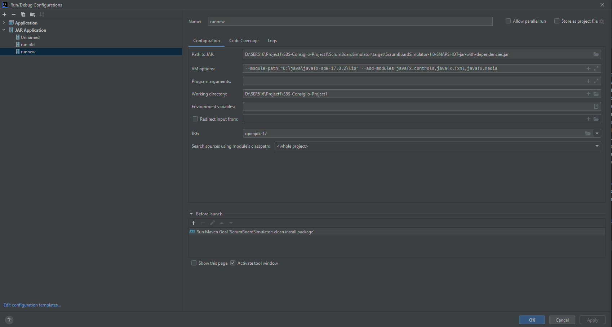

# SBS-Consiglio-Project1
This repository contains our team's work for the SER 516 semester project.

## Setup
To setup the project you need to download a few things first. 
1. Openjdk17
2. Java 17

Now we will use Intellij for the instructions however the steps in eclipse should be the same. 

1. Setup the maven project in the IDE 
2. Set the project compiler level to 17 and the ide to 17
3. Run the build using this configuration mvn clean package install and the dependencies should download upon build.
4. You can run the program using the command below however you need to add this to the VM arguments: --module-path="path/to/lib/folder" --add-modules=javafx.controls,javafx.fxml,javafx.media


## How to run
* For the following ensure module path is the directory to your javafx sdk 17 lib folder.
* Launching jar from command line: ```java -jar --module-path="D:\java\javafx-sdk-17.0.2\lib" --add-modules=javafx.controls,javafx.fxml,javafx.media target/ScrumBoardSimulator-1.0-SNAPSHOT-jar-with-dependencies.jar```
* Add the configuration: 
## Continuous Integration
[http://jenkins2.crisp.se/job/betrcode/job/ScrumBoardSimulator/](http://jenkins2.crisp.se/job/betrcode/job/ScrumBoardSimulator/)
This job is triggered automatically by a Jenkins hook on GitHub.

## Contributors

### Original
Max Wenzin
Oscar Lantz

### New
David Bieganski
Dhruvi Jayeshkumar Modi
Bhavana Priya Kanumuri
Nabeel Khan

### Even newer
Gianni Consiglio
Rephael Jackson
